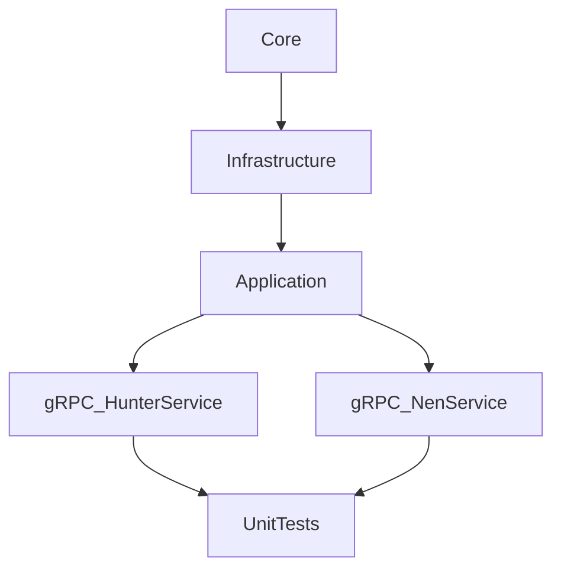

# Hunter x Hunter Microservices .NET 9

### Clean Code Architecture


### Packages (Server)
- Infrastructure
```
Microsoft.Extensions.Logging
Oracle.ManagedDataAccess.Core
ClassLibrary.Core
```
- Application
```
ClassLibrary.Infrastructure
```
- gRPC.HunterNenService
- gRPC_HunterService
- gRPC_NenService
```
Grpc.AspNetCore
ClassLibrary.Application
```
- TestProject.UnitTests
```
Grpc.Core
Moq
ClassLibrary.Application
gRPC.HunterNenService
```

## gRPC: (google) Remote Procedure Call
- Diference between gRPC and API
> gRPC uses HTTP/2, while REST APIs typically use HTTP/1.1.

### gRPC
- Protocol Buffers
- http2
- Serealization, Deserealization
- Bidirectional streaming
- (Authentication, Load Balancer, Async Calls)

### API
- JSON
- REST

# Projects
- gRPC_HunterService
- gRPC_NenService

# Structure
```
/HxH_Microservice_.NETCore
│
├── /ClassLibrary.Application           <-- Librería de clases: Lógica de Aplicación
│   └── /Services
│       ├── HunterNenService.cs
│       ├── HunterService.cs
│       └── NenService.cs
│
├── /ClassLibrary.Core                  <-- Librería de clases: Dominio (Core)
│   ├── /Common
│   │   └── Result.cs
│   ├── /DTOs
│   │   ├── HunterDTO.cs
│   │   ├── HunterNenDTO.cs
│   │   └── NenTypeDTO.cs
│   └── /Interfaces
│       ├── IHunterNenRepository.cs
│       ├── IHunterNenService.cs
│       ├── IHunterRepository.cs
│       ├── IHunterService.cs
│       ├── INenRepository.cs
│       └── INenService.cs
│
├── /ClassLibrary.Infrastructure        <-- Librería de clases: Infraestructura
│   ├── /Data
│   │   └── OracleDbContext.cs
│   └── /Repositories
│       ├── HunterNenRepository.cs
│       ├── HunterRepository.cs
│       └── NenRepository.cs
│
├── /gRPC.HunterNenService                 <-- Microservicio de HunterNen (gRPC)
│   ├── /Mappers
│   │   └── HunterNenMapper.cs
│   ├── /Proto
│   │   └── hunter.proto
│   ├── /Services
│   │   └── HunterGrpcService.cs
│   ├── appsettings.json
│   └── Program.cs
│
├── /gRPC_HunterService                 <-- Microservicio de Hunter (gRPC)
│   ├── /Proto
│   │   └── hunternen.proto
│   ├── /Services
│   │   └── GrpcHunterNenService.cs
│   ├── appsettings.json
│   └── Program.cs
│
├── /gRPC_NenService                    <-- Microservicio de Nen (gRPC)
│   ├── /Proto
│   │   └── nen.proto
│   ├── /Services
│   │   └── NenGrpcService.cs
│   ├── appsettings.json
│   └── Program.cs
│
├── /gRPC_Gateway                       <-- Proyecto WebAPI (si decides exponer una API RESTful)
│   ├── /Controllers
│   │   └── HunterNenController.cs
│   ├── /Protos
│   │   └── hunter_nen.proto
│   ├── appsettings.json
│   └── Program.cs
│
└── /TestProject.UnitTests              <-- Proyecto de pruebas unitarias
    ├── /Application.Tests
    │   ├── HunterNenServiceTests.cs
    │   ├── HunterServiceTests.cs
    │   └── NenServiceTests.cs
    ├── /Infrastructure.Tests
    │   ├── DatabaseCollection.cs
    │   ├── DatabaseFixture.cs
    │   ├── HunterNenRepositoryIntegrationTests.cs
    │   ├── HunterRepositoryIntegrationTests.cs
    │   └── NenRepositoryIntegrationTests.cs
    ├── /gRPC.Tests
    │   ├── GrpcHunterNenServiceTests.cs
    │   └── TestServerCallContext.cs  
    └── /WebAPI.Tests
        └── HunterControllerTests.cs
```

# Steps for Creating Clean Architecture"
## Core
- Common
```
public class Result<T>
{
    public bool IsSuccess { get; }
    public bool IsFailure => !IsSuccess;
    public string Message { get; }
    public T? Data { get; }

    private Result(bool isSuccess, string message, T? data = default)
    {
        IsSuccess = isSuccess;
        Message = message;
        Data = data;
    }

    public static Result<T> Success(T? data = default, string message = "") => new(true, message, data);
    public static Result<T> Failure(string message) => new(false, message);
}
```
- Entities and DTOs
```
public class HunterNenDTO
{
    public int Id_Hunter { get; set; }
    public int Id_NenType { get; set; }
    public float NenLevel { get; set; }
}
```
- Interfaces
```
public interface IHunterNenRepository
{
    Task<IEnumerable<HunterNenDTO>> GetAllHunterNensAsync();
    Task<HunterNenDTO?> GetHunterNenByIdAsync(HunterNenDTO hunterNen);
    Task<Result<bool>> InsertHunterNenAsync(HunterNenDTO hunterNen);
    Task<Result<bool>> UpdateHunterNenAsync(HunterNenDTO hunterNen);
    Task<Result<bool>> DeleteHunterNenAsync(HunterNenDTO hunterNen);
}
```
```
public interface IHunterNenService
{
    Task<IEnumerable<HunterNenDTO>> GetAllHunterNensAsync();
    Task<HunterNenDTO?> GetHunterNenByIdAsync(HunterNenDTO hunterNen);
    Task<Result<bool>> InsertHunterNenAsync(HunterNenDTO hunterNen);
    Task<Result<bool>> UpdateHunterNenAsync(HunterNenDTO hunterNen);
    Task<Result<bool>> DeleteHunterNenAsync(HunterNenDTO hunterNen);
}
```

## Infrastructure
- Data
```
public class OracleDbContext
{
    private readonly string _connectionString;
    private readonly ILogger<OracleDbContext> _logger;

    public OracleDbContext(string connectionString, ILogger<OracleDbContext> logger)
    {
        _connectionString = connectionString;
        _logger = logger;
    }

    public async Task<DataTable> ExecuteQueryAsync(string query, params OracleParameter[] parameters)
    {
        try
        {
            using var connection = new OracleConnection(_connectionString);
            await connection.OpenAsync();

            using var command = new OracleCommand(query, connection);
            if (parameters.Length > 0)
                command.Parameters.AddRange(parameters);

            using var reader = await command.ExecuteReaderAsync();
            var resultTable = new DataTable();
            resultTable.Load(reader);

            _logger.LogInformation("[OracleDbContext] Query executed: {Query} with Parameters: {@Parameters}", query, parameters);
            return resultTable;
        }
        catch (OracleException ex)
        {
            _logger.LogError(ex, "[OracleDbContext] Oracle error in ExecuteNonQueryAsync with query: {Query}", query);
            throw;
        }
        catch (Exception ex)
        {
            _logger.LogError(ex, "[OracleDbContext] Error in ExecuteNonQueryAsync with query: {Query} and Parameters: {@Parameters}", query, parameters);
            throw;
        }        
    }

    public async Task<int> ExecuteNonQueryAsync(string query, params OracleParameter[] parameters)
    {
        try
        {
            using var connection = new OracleConnection(_connectionString);
            await connection.OpenAsync();

            using var command = new OracleCommand(query, connection);
            if (parameters.Length > 0)
                command.Parameters.AddRange(parameters);

            _logger.LogInformation("[OracleDbContext] Query execute correctly: {Query}", query);
            return await command.ExecuteNonQueryAsync();
        }
        catch (OracleException ex)
        {
            _logger.LogError(ex, "[OracleDbContext] Oracle error in ExecuteNonQueryAsync with query: {Query}", query);
            throw;
        }
        catch (Exception ex)
        {
            _logger.LogError(ex, "[OracleDbContext] Error in ExecuteNonQueryAsync with query: {Query}", query);
            throw;
        }
    }

    public async Task<T> ExecuteScalarAsync<T>(string query, params OracleParameter[] parameters)
    {
        try
        {
            using var connection = new OracleConnection(_connectionString);
            await connection.OpenAsync();

            using var command = new OracleCommand(query, connection);
            if (parameters.Length > 0)
                command.Parameters.AddRange(parameters);

            // Ejecuta la consulta y devuelve el resultado como tipo T
            var result = await command.ExecuteScalarAsync();
            return (T)Convert.ChangeType(result, typeof(T));
        }
        catch (OracleException ex)
        {
            _logger.LogError(ex, "[OracleDbContext] Oracle error in ExecuteNonQueryAsync with query: {Query}", query);
            throw;
        }
        catch (Exception ex)
        {
            _logger.LogError(ex, "[OracleDbContext] Error in ExecuteScalarAsync with query: {Query}", query);
            throw;
        }
    }
}
```
- Repositories
```
public class HunterNenRepository : IHunterNenRepository
{
    private readonly ILogger<HunterNenRepository> _logger;
    private readonly OracleDbContext _context;

    public HunterNenRepository(ILogger<HunterNenRepository> logger, OracleDbContext context)
    {
        _logger = logger;
        _context = context;
    }

    // GET ALL
    public async Task<IEnumerable<HunterNenDTO>> GetAllHunterNensAsync()
    {
        _logger.LogInformation("Retrieving all HunterNens");
        const string query = "SELECT Id_Hunter, Id_Nen_Type, Nen_Level FROM Hunter_Nen";

        var dataTable = await _context.ExecuteQueryAsync(query);

        var result = new List<HunterNenDTO>();
        foreach (DataRow row in dataTable.Rows)
        {
            result.Add(new HunterNenDTO
            {
                Id_Hunter = Convert.ToInt32(row["ID_HUNTER"]),
                Id_NenType = Convert.ToInt32(row["ID_NEN_TYPE"]),
                NenLevel = Convert.ToInt32(row["NEN_LEVEL"]),
            });
        }

        return result;
    }

    // GET BY ID
    public async Task<HunterNenDTO?> GetHunterNenByIdAsync(HunterNenDTO hunterNen)
    {
        _logger.LogInformation("Retrieving HunterNen by Id: {@HunterNen}", hunterNen);

        const string query = "SELECT Id_Hunter, Id_Nen_Type, Nen_Level FROM Hunter_Nen WHERE Id_Hunter = :Id_Hunter AND Id_Nen_Type = :Id_NenType";

        var parameters = new[]
        {
            new OracleParameter("Id_Hunter", hunterNen.Id_Hunter),
            new OracleParameter("Id_NenType", hunterNen.Id_NenType)
        };

        var dataTable = await _context.ExecuteQueryAsync(query, parameters);

        if (dataTable.Rows.Count == 0)
            return null;

        var row = dataTable.Rows[0];
        return new HunterNenDTO
        {
            Id_Hunter = Convert.ToInt32(row["ID_HUNTER"]),
            Id_NenType = Convert.ToInt32(row["ID_NEN_TYPE"]),
            NenLevel = Convert.ToInt32(row["NEN_LEVEL"]),
        };
    }

    // INSERT
    public async Task<Result<bool>> InsertHunterNenAsync(HunterNenDTO hunterNen)
    {
        var validationResult = ValidateHunterNen(hunterNen);
        if (validationResult.IsFailure)
        {
            _logger.LogWarning("Validation failed: {Message}", validationResult.Message);
            return validationResult;
        }

        var foreignKeyResult = await ValidateForeignKeysAsync(hunterNen);
        if (foreignKeyResult.IsFailure)
        {
            _logger.LogWarning("Foreign key validation failed: {Message}", foreignKeyResult.Message);
            return foreignKeyResult;
        }

        if (await HunterNenExists(hunterNen))
        {
            _logger.LogInformation("HunterNen already exists: {@HunterNen}", hunterNen);
            return Result<bool>.Failure("HunterNen already exists.");
        }

        const string query = "INSERT INTO Hunter_Nen (Id_Hunter, Id_Nen_Type, Nen_Level) VALUES (:Id_Hunter, :Id_NenType, :NenLevel)";

        var parameters = new[]
        {
            new OracleParameter("Id_Hunter", hunterNen.Id_Hunter),
            new OracleParameter("Id_NenType", hunterNen.Id_NenType),
            new OracleParameter("NenLevel", hunterNen.NenLevel),
        };

        var affectedRows = await _context.ExecuteNonQueryAsync(query, parameters);

        if (affectedRows > 0)
        {
            _logger.LogInformation("Insert successful.");
            return Result<bool>.Success(true, "Inserted successfully.");
        }

        _logger.LogError("Insert failed for: {@HunterNen}", hunterNen);
        return Result<bool>.Failure("Failed to insert HunterNen.");
    }

    // UPDATE
    public async Task<Result<bool>> UpdateHunterNenAsync(HunterNenDTO hunterNen)
    {
        var validationResult = ValidateHunterNen(hunterNen);
        if (validationResult.IsFailure)
        {
            _logger.LogWarning("Validation failed: {Message}", validationResult.Message);
            return validationResult;
        }

        var foreignKeyResult = await ValidateForeignKeysAsync(hunterNen);
        if (foreignKeyResult.IsFailure)
        {
            _logger.LogWarning("Foreign key validation failed: {Message}", foreignKeyResult.Message);
            return foreignKeyResult;
        }

        if (!await HunterNenExists(hunterNen))
        {
            _logger.LogInformation("HunterNen does not exist: {@HunterNen}", hunterNen);
            return Result<bool>.Failure("HunterNen does not exist.");
        }

        const string query = @"
            UPDATE Hunter_Nen 
            SET Nen_Level = :NenLevel 
            WHERE Id_Hunter = :Id_Hunter AND Id_Nen_Type = :Id_NenType";

        var parameters = new[]
        {
            new OracleParameter("NenLevel", hunterNen.NenLevel),
            new OracleParameter("Id_Hunter", hunterNen.Id_Hunter),
            new OracleParameter("Id_NenType", hunterNen.Id_NenType)
        };

        var affectedRows = await _context.ExecuteNonQueryAsync(query, parameters);

        if (affectedRows > 0)
        {
            _logger.LogInformation("Update successful.");
            return Result<bool>.Success(true, "Updated successfully.");
        }

        _logger.LogError("Update failed for: {@HunterNen}", hunterNen);
        return Result<bool>.Failure("Failed to update HunterNen.");
    }

    // DELETE
    public async Task<Result<bool>> DeleteHunterNenAsync(HunterNenDTO hunterNen)
    {
        var validationResult = ValidateHunterNen(hunterNen);
        if (validationResult.IsFailure)
        {
            _logger.LogWarning("Validation failed: {Message}", validationResult.Message);
            return validationResult;
        }

        if (!await HunterNenExists(hunterNen))
        {
            _logger.LogInformation("HunterNen does not exist: {@HunterNen}", hunterNen);
            return Result<bool>.Failure("HunterNen does not exist.");
        }

        const string query = "DELETE FROM Hunter_Nen WHERE Id_Hunter = :Id_Hunter AND Id_Nen_Type = :Id_NenType";

        var parameters = new[]
        {
            new OracleParameter("Id_Hunter", hunterNen.Id_Hunter),
            new OracleParameter("Id_NenType", hunterNen.Id_NenType)
        };

        var affectedRows = await _context.ExecuteNonQueryAsync(query, parameters);

        if (affectedRows > 0)
        {
            _logger.LogInformation("Delete successful.");
            return Result<bool>.Success(true, "Deleted successfully.");
        }

        _logger.LogError("Delete failed for: {@HunterNen}. AffectedRows: {AffectedRows}", hunterNen, affectedRows);
        return Result<bool>.Failure("Failed to delete HunterNen.");
    }

    // HELPERS
    private async Task<bool> HunterNenExists(HunterNenDTO hunterNen)
    {
        const string query = "SELECT COUNT(1) FROM Hunter_Nen WHERE Id_Hunter = :Id_Hunter AND Id_Nen_Type = :Id_NenType";
        var parameters = new[]
        {
            new OracleParameter("Id_Hunter", hunterNen.Id_Hunter),
            new OracleParameter("Id_NenType", hunterNen.Id_NenType)
        };

        var count = await _context.ExecuteScalarAsync<int>(query, parameters);
        return count > 0;
    }

    private Result<bool> ValidateHunterNen(HunterNenDTO hunterNen)
    {
        if (hunterNen == null)
            return Result<bool>.Failure("HunterNen cannot be null");

        if (hunterNen.Id_Hunter <= 0)
            return Result<bool>.Failure("Id_Hunter must be greater than 0");

        if (hunterNen.Id_NenType <= 0)
            return Result<bool>.Failure("Id_NenType must be greater than 0");

        if (hunterNen.NenLevel < 1 || hunterNen.NenLevel > 100)
            return Result<bool>.Failure("NenLevel must be between 1 and 100");

        return Result<bool>.Success(true);
    }

    private async Task<Result<bool>> ValidateForeignKeysAsync(HunterNenDTO hunterNen)
    {
        var hunterResult = await CheckExistence("Hunter", "Id_Hunter", hunterNen.Id_Hunter);
        if (hunterResult.IsFailure)
        {
            _logger.LogWarning("Hunter not found: {Message}", hunterResult.Message);
            return hunterResult;
        }

        var nenResult = await CheckExistence("Nen_Type", "Id_Nen_Type", hunterNen.Id_NenType);
        if (nenResult.IsFailure)
        {
            _logger.LogWarning("NenType not found: {Message}", nenResult.Message);
            return nenResult;
        }

        return Result<bool>.Success(true);
    }

    private async Task<Result<bool>> CheckExistence(string table, string column, int value)
    {
        var allowedTables = new[] { "Hunter", "Nen_Type" };
        if (!allowedTables.Contains(table))
            return Result<bool>.Failure("Invalid table name");

        var query = $"SELECT COUNT(1) FROM {table} WHERE {column} = :value";
        var param = new OracleParameter("value", value);
        var count = await _context.ExecuteScalarAsync<int>(query, param);

        return count > 0
            ? Result<bool>.Success(true)
            : Result<bool>.Failure($"{table} with {column} = {value} not found.");
    }
}
```
## Application
- Services
```
public class HunterNenService : IHunterNenService
{
    private readonly ILogger<HunterService> _logger;
    private readonly IHunterNenRepository _hunterNenRepository;

    public HunterNenService(ILogger<HunterService> logger, IHunterNenRepository hunterNenRepository)
    {
        _logger = logger;
        _hunterNenRepository = hunterNenRepository;
    }

    public async Task<IEnumerable<HunterNenDTO>> GetAllHunterNensAsync()
    {
        _logger.LogInformation("[HunterNenService] Retrieving all HunterNens");
        return await _hunterNenRepository.GetAllHunterNensAsync();
    }

    public async Task<HunterNenDTO?> GetHunterNenByIdAsync(HunterNenDTO hunterNen)
    {
        _logger.LogInformation("[HunterNenService] Retrieving HunterNen by ID: {@HunterNen}", hunterNen);
        return await _hunterNenRepository.GetHunterNenByIdAsync(hunterNen);
    }

    public async Task<Result<bool>> InsertHunterNenAsync(HunterNenDTO hunterNen)
    {
        _logger.LogInformation("[HunterNenService] Inserting new HunterNen: {@HunterNen}", hunterNen);
        return await _hunterNenRepository.InsertHunterNenAsync(hunterNen);
    }

    public Task<Result<bool>> UpdateHunterNenAsync(HunterNenDTO hunterNen)
    {
        _logger.LogInformation("[HunterNenService] Updating HunterNen: {@HunterNen}", hunterNen);
        return _hunterNenRepository.UpdateHunterNenAsync(hunterNen);
    }

    public Task<Result<bool>> DeleteHunterNenAsync(HunterNenDTO hunterNen)
    {
        _logger.LogInformation("[HunterNenService] Deleting HunterNen: {@HunterNen}", hunterNen);
        return _hunterNenRepository.DeleteHunterNenAsync(hunterNen);
    }
}
```

## gRPC
- appsettings.json
```
"ConnectionStrings": {
    "OracleDb": "User Id=testing;Password=testing;Data Source=localhost:1521/xe"
}
```
- Program.cs
```
builder.Services.AddScoped<OracleDbContext>(sp =>
{
    var connectionString = builder.Configuration.GetConnectionString("OracleDb");
    var logger = sp.GetRequiredService<ILogger<OracleDbContext>>();
    return new OracleDbContext(connectionString, logger);
});

builder.Services.AddScoped<IHunterNenRepository, HunterNenRepository>();
builder.Services.AddScoped<IHunterNenService, HunterNenService>();

var app = builder.Build();

app.MapGrpcService<GrpcHunterNenService>();
```
- Protos
```
syntax = "proto3";

option csharp_namespace = "gRPC.HunterNenService";

package hunternen;

service HunterNenProto {
	rpc HunterNenGetAll (Empty) returns (HunterNenListResponse);
	rpc HunterNenGetById (HunterNenRequest) returns (HunterNenResponse);
	rpc HunterNenInsert (HunterNenRequest) returns (GenericResponse);
	rpc HunterNenUpdate (HunterNenRequest) returns (GenericResponse);
	rpc HunterNenDelete (HunterNenRequest) returns (GenericResponse);
}

message Empty {}

message HunterNenRequest {
	int32 idHunter = 1;
	int32 idNen = 2;
	float nenLevel = 3;
}

message HunterNenResponse {
	int32 idHunter = 1;
	int32 idNen = 2;
	float nenLevel = 3;
}

message HunterNenListResponse {
	repeated HunterNenResponse hunterNens = 1;
}

message GenericResponse {
	bool success = 1;
	string message = 2;
}
```
- Services
```
public class GrpcHunterNenService : HunterNenProto.HunterNenProtoBase
{
    private readonly ILogger<GrpcHunterNenService> _logger;
    private readonly IHunterNenService _hunterNenService;

    public GrpcHunterNenService(ILogger<GrpcHunterNenService> logger, IHunterNenService hunterNenService)
    {
        _logger = logger;
        _hunterNenService = hunterNenService;
    }

    public override async Task<HunterNenListResponse> HunterNenGetAll(Empty request, ServerCallContext context)
    {
        _logger.LogInformation("gRPC request: HunterNenGetAll");
        var hunterNens = await _hunterNenService.GetAllHunterNensAsync();
        var response = new HunterNenListResponse();

        foreach (var hunterNen in hunterNens)
        {
            response.HunterNens.Add(new HunterNenResponse
            {
                IdHunter = hunterNen.Id_Hunter,
                IdNen = hunterNen.Id_NenType,
                NenLevel = hunterNen.NenLevel
            });
        }

        _logger.LogInformation("Retrieved {Count} HunterNens", response.HunterNens.Count);
        return response;
    }

    public override async Task<HunterNenResponse> HunterNenGetById(HunterNenRequest request, ServerCallContext context)
    {
        _logger.LogInformation("gRPC request: HunterNenGetById for Hunter {IdHunter} and Nen {IdNen}", request.IdHunter, request.IdNen);
        var dto = HunterNenMapper.ToDTO(request);
        var result = await _hunterNenService.GetHunterNenByIdAsync(dto);

        if (result == null)
        {
            _logger.LogWarning("HunterNen not found for Hunter {IdHunter}, Nen {IdNen}", request.IdHunter, request.IdNen);
            throw new RpcException(new Status(StatusCode.NotFound, "HunterNen not found"));
        }

        _logger.LogInformation("HunterNen found: Hunter {IdHunter}, Nen {IdNen}", result.Id_Hunter, result.Id_NenType);
        return new HunterNenResponse
        {
            IdHunter = result.Id_Hunter,
            IdNen = result.Id_NenType,
            NenLevel = result.NenLevel
        };
    }

    public override async Task<GenericResponse> HunterNenInsert(HunterNenRequest request, ServerCallContext context)
    {
        _logger.LogInformation("gRPC request: HunterNenInsert for Hunter {IdHunter}, Nen {IdNen}", request.IdHunter, request.IdNen);

        var dto = HunterNenMapper.ToDTO(request);
        var result = await _hunterNenService.InsertHunterNenAsync(dto);

        if (!result.IsSuccess)
        {
            _logger.LogWarning("Insert failed: {Message}", result.Message);
            return new GenericResponse { Success = false, Message = result.Message };
        }

        _logger.LogInformation("Insert successful for Hunter {IdHunter}, Nen {IdNen}", request.IdHunter, request.IdNen);
        return new GenericResponse { Success = true, Message = "HunterNen inserted successfully" };
    }


    public override async Task<GenericResponse> HunterNenUpdate(HunterNenRequest request, ServerCallContext context)
    {
        _logger.LogInformation("gRPC request: HunterNenUpdate for Hunter {IdHunter}, Nen {IdNen}", request.IdHunter, request.IdNen);
        var dto = HunterNenMapper.ToDTO(request);
        var result = await _hunterNenService.UpdateHunterNenAsync(dto);

        if (!result.IsSuccess)
        {
            _logger.LogWarning("Update failed: {Message}", result.Message);
            return new GenericResponse { Success = false, Message = result.Message };
        }

        _logger.LogInformation("Update successful for Hunter {IdHunter}, Nen {IdNen}", request.IdHunter, request.IdNen);
        return new GenericResponse { Success = true, Message = "HunterNen updated successfully" };
    }

    public override async Task<GenericResponse> HunterNenDelete(HunterNenRequest request, ServerCallContext context)
    {
        _logger.LogInformation("gRPC request: HunterNenDelete for Hunter {IdHunter}, Nen {IdNen}", request.IdHunter, request.IdNen);
        var dto = HunterNenMapper.ToDTO(request);
        var result = await _hunterNenService.DeleteHunterNenAsync(dto);

        if (!result.IsSuccess)
        {
            _logger.LogWarning("Delete failed: {Message}", result.Message);
            return new GenericResponse { Success = false, Message = result.Message };
        }

        _logger.LogInformation("Delete successful for Hunter {IdHunter}, Nen {IdNen}", request.IdHunter, request.IdNen);
        return new GenericResponse { Success = true, Message = "HunterNen deleted successfully" };
    }
}
```

## Unit Tests
- Application.Tests
```
public class HunterNenServiceTests
{
    private readonly Mock<ILogger<HunterService>> _mockLogger;
    private readonly Mock<IHunterNenRepository> _mockRepo;
    private readonly HunterNenService _hunterNenService;

    public HunterNenServiceTests()
    {
        _mockLogger = new Mock<ILogger<HunterService>>();
        _mockRepo = new Mock<IHunterNenRepository>();
        _hunterNenService = new HunterNenService(_mockLogger.Object, _mockRepo.Object);
    }

    [Fact]
    public async Task GetAllHunterNensAsync_ShouldReturnListOfHunterNens()
    {
        // Arrange
        var hunterNens = new List<HunterNenDTO>
        {
            new HunterNenDTO { Id_Hunter = 1, Id_NenType = 1, NenLevel = 50 },
            new HunterNenDTO { Id_Hunter  = 2, Id_NenType = 2, NenLevel = 80 }
        };
        _mockRepo.Setup(r => r.GetAllHunterNensAsync()).ReturnsAsync(hunterNens);
       
        // Act
        var result = await _hunterNenService.GetAllHunterNensAsync();
        
        // Assert
        Assert.Equal(hunterNens.Count, result.Count());
        _mockRepo.Verify(r => r.GetAllHunterNensAsync(), Times.Once);
    }

    [Fact]
    public async Task GetHunterNenByIdAsync_ShouldReturnHunterNen_WhenExists()
    {
        // Arrange
        var hunterNen = new HunterNenDTO { Id_Hunter = 1, Id_NenType = 1, NenLevel = 50 };
        _mockRepo.Setup(r => r.GetHunterNenByIdAsync(hunterNen)).ReturnsAsync(hunterNen);

        // Act
        var result = await _hunterNenService.GetHunterNenByIdAsync(hunterNen);

        // Assert
        Assert.Equal(hunterNen, result);
        _mockRepo.Verify(r => r.GetHunterNenByIdAsync(hunterNen), Times.Once);
    }

    [Fact]
    public async Task GetHunterNenByIdAsync_ShouldReturnNull_WhenNotExists()
    {
        // Arrange
        var hunterNen = new HunterNenDTO { Id_Hunter = 1, Id_NenType = 1, NenLevel = 50 };
        _mockRepo.Setup(r => r.GetHunterNenByIdAsync(hunterNen)).ReturnsAsync((HunterNenDTO?)null);

        // Act
        var result = await _hunterNenService.GetHunterNenByIdAsync(hunterNen);
        
        // Assert
        Assert.Null(result);
        _mockRepo.Verify(r => r.GetHunterNenByIdAsync(hunterNen), Times.Once);
    }

    [Fact]
    public async Task InsertHunterNenAsync_ShouldReturnTrue_WhenInsertionSucceeds()
    {
        // Arrange
        var hunterNen = new HunterNenDTO { Id_Hunter = 1, Id_NenType = 1, NenLevel = 50 };
        _mockRepo.Setup(r => r.InsertHunterNenAsync(hunterNen)).ReturnsAsync(Result<bool>.Success(true));

        // Act
        var result = await _hunterNenService.InsertHunterNenAsync(hunterNen);
        
        // Assert
        Assert.True(result.IsSuccess);
        _mockRepo.Verify(r => r.InsertHunterNenAsync(hunterNen), Times.Once);
    }

    [Fact]
    public async Task InsertHunterNenAsync_ShouldReturnFalse_WhenInsertionFails()
    {
        // Arrange
        var hunterNen = new HunterNenDTO { Id_Hunter = 1, Id_NenType = 1, NenLevel = 50 };
        _mockRepo.Setup(r => r.InsertHunterNenAsync(hunterNen)).ReturnsAsync(Result<bool>.Failure("Insertion failed"));
    
        // Act
        var result = await _hunterNenService.InsertHunterNenAsync(hunterNen);
        
        // Assert
        Assert.False(result.IsSuccess);
        _mockRepo.Verify(r => r.InsertHunterNenAsync(hunterNen), Times.Once);
    }

    [Fact]
    public async Task UpdateHunterNenAsync_ShouldReturnTrue_WhenUpdateSucceeds()
    {
        // Arrange
        var hunterNen = new HunterNenDTO { Id_Hunter = 1, Id_NenType = 1, NenLevel = 50 };
        _mockRepo.Setup(r => r.UpdateHunterNenAsync(hunterNen)).ReturnsAsync(Result<bool>.Success(true));

        // Act
        var result = await _hunterNenService.UpdateHunterNenAsync(hunterNen);

        // Assert
        Assert.True(result.IsSuccess);
        _mockRepo.Verify(r => r.UpdateHunterNenAsync(hunterNen), Times.Once);
    }

    [Fact]
    public async Task UpdateHunterNenAsync_ShouldReturnFalse_WhenUpdateFails()
    {
        // Arrange
        var hunterNen = new HunterNenDTO { Id_Hunter = 1, Id_NenType = 1, NenLevel = 50 };
        _mockRepo.Setup(r => r.UpdateHunterNenAsync(hunterNen)).ReturnsAsync(Result<bool>.Failure("Update failed"));

        // Act
        var result = await _hunterNenService.UpdateHunterNenAsync(hunterNen);

        // Assert
        Assert.False(result.IsSuccess);
        _mockRepo.Verify(r => r.UpdateHunterNenAsync(hunterNen), Times.Once);
    }

    [Fact]
    public async Task DeleteHunterNenAsync_ShouldReturnTrue_WhenDeletionSucceeds()
    {
        // Arrange
        var hunterNen = new HunterNenDTO { Id_Hunter = 1, Id_NenType = 1, NenLevel = 50 };
        _mockRepo.Setup(r => r.DeleteHunterNenAsync(hunterNen)).ReturnsAsync(Result<bool>.Success(true));

        // Act
        var result = await _hunterNenService.DeleteHunterNenAsync(hunterNen);
        
        // Assert
        Assert.True(result.IsSuccess);
        _mockRepo.Verify(r => r.DeleteHunterNenAsync(hunterNen), Times.Once);
    }

    [Fact]
    public async Task DeleteHunterNenAsync_ShouldReturnFalse_WhenDeletionFails()
    {
        // Arrange
        var hunterNen = new HunterNenDTO { Id_Hunter = 1, Id_NenType = 1, NenLevel = 50 };
        _mockRepo.Setup(r => r.DeleteHunterNenAsync(hunterNen)).ReturnsAsync(Result<bool>.Failure("Deletion failed"));
       
        // Act
        var result = await _hunterNenService.DeleteHunterNenAsync(hunterNen);

        // Assert
        Assert.False(result.IsSuccess);
        _mockRepo.Verify(r => r.DeleteHunterNenAsync(hunterNen), Times.Once);
    }
}
```
- Infrastructure.Tests
```
[Collection("Database collection")]
public class HunterNenRepositoryIntegrationTests
{
    private readonly HunterNenRepository _hunterNenRepository;

    public HunterNenRepositoryIntegrationTests(DatabaseFixture fixture)
    {
        var logger = NullLogger<HunterNenRepository>.Instance;
        _hunterNenRepository = new HunterNenRepository(logger, fixture.DbContext);
    }

    [Fact]
    public async Task InsertHunterNenAsync_AlreadyExists_ReturnsFailure()
    {
        // Arrange
        var existingDto = new HunterNenDTO { Id_Hunter = 1, Id_NenType = 1, NenLevel = 50 };

        // Act
        var result = await _hunterNenRepository.InsertHunterNenAsync(existingDto);

        // Assert
        Assert.False(result.IsSuccess);
        Assert.Equal("HunterNen already exists.", result.Message);
    }

    [Fact]
    public async Task InsertHunterNenAsync_ValidDto_InsertsSuccessfullyAndCleansUp()
    {
        // Arrange
        var dto = new HunterNenDTO { Id_Hunter = 4, Id_NenType = 4, NenLevel = 50 };

        // Act
        var result = await _hunterNenRepository.InsertHunterNenAsync(dto);

        // Assert
        Assert.True(result.IsSuccess);
        Assert.True(result.Data);
        Assert.Equal("Inserted successfully.", result.Message);

        // Clean up: borrar el registro insertado
        await _hunterNenRepository.DeleteHunterNenAsync(dto);
    }

    [Fact]
    public async Task InsertHunterNenAsync_HunterNotFound_ReturnsFailure()
    {
        // Arrange
        var dto = new HunterNenDTO { Id_Hunter = 9999, Id_NenType = 1, NenLevel = 50 };

        // Act
        var result = await _hunterNenRepository.InsertHunterNenAsync(dto);

        // Assert
        Assert.False(result.IsSuccess);
        //Assert.Equal("Hunter not found.", result.Message);
    }

    [Fact]
    public async Task InsertHunterNenAsync_NenTypeNotFound_ReturnsFailure()
    {
        // Arrange
        var dto = new HunterNenDTO { Id_Hunter = 1, Id_NenType = 9999, NenLevel = 50 };

        // Act
        var result = await _hunterNenRepository.InsertHunterNenAsync(dto);

        // Assert
        Assert.False(result.IsSuccess);
        //Assert.Equal("NenType not found.", result.Message);
    }
}
```
- gRPC Tests
```
public class HunterNenServiceTests
{
    private readonly Mock<ILogger<HunterService>> _mockLogger;
    private readonly Mock<IHunterNenRepository> _mockRepo;
    private readonly HunterNenService _hunterNenService;

    public HunterNenServiceTests()
    {
        _mockLogger = new Mock<ILogger<HunterService>>();
        _mockRepo = new Mock<IHunterNenRepository>();
        _hunterNenService = new HunterNenService(_mockLogger.Object, _mockRepo.Object);
    }

    [Fact]
    public async Task GetAllHunterNensAsync_ShouldReturnListOfHunterNens()
    {
        // Arrange
        var hunterNens = new List<HunterNenDTO>
        {
            new HunterNenDTO { Id_Hunter = 1, Id_NenType = 1, NenLevel = 50 },
            new HunterNenDTO { Id_Hunter  = 2, Id_NenType = 2, NenLevel = 80 }
        };
        _mockRepo.Setup(r => r.GetAllHunterNensAsync()).ReturnsAsync(hunterNens);
       
        // Act
        var result = await _hunterNenService.GetAllHunterNensAsync();
        
        // Assert
        Assert.Equal(hunterNens.Count, result.Count());
        _mockRepo.Verify(r => r.GetAllHunterNensAsync(), Times.Once);
    }

    [Fact]
    public async Task GetHunterNenByIdAsync_ShouldReturnHunterNen_WhenExists()
    {
        // Arrange
        var hunterNen = new HunterNenDTO { Id_Hunter = 1, Id_NenType = 1, NenLevel = 50 };
        _mockRepo.Setup(r => r.GetHunterNenByIdAsync(hunterNen)).ReturnsAsync(hunterNen);

        // Act
        var result = await _hunterNenService.GetHunterNenByIdAsync(hunterNen);

        // Assert
        Assert.Equal(hunterNen, result);
        _mockRepo.Verify(r => r.GetHunterNenByIdAsync(hunterNen), Times.Once);
    }

    [Fact]
    public async Task GetHunterNenByIdAsync_ShouldReturnNull_WhenNotExists()
    {
        // Arrange
        var hunterNen = new HunterNenDTO { Id_Hunter = 1, Id_NenType = 1, NenLevel = 50 };
        _mockRepo.Setup(r => r.GetHunterNenByIdAsync(hunterNen)).ReturnsAsync((HunterNenDTO?)null);

        // Act
        var result = await _hunterNenService.GetHunterNenByIdAsync(hunterNen);
        
        // Assert
        Assert.Null(result);
        _mockRepo.Verify(r => r.GetHunterNenByIdAsync(hunterNen), Times.Once);
    }

    [Fact]
    public async Task InsertHunterNenAsync_ShouldReturnTrue_WhenInsertionSucceeds()
    {
        // Arrange
        var hunterNen = new HunterNenDTO { Id_Hunter = 1, Id_NenType = 1, NenLevel = 50 };
        _mockRepo.Setup(r => r.InsertHunterNenAsync(hunterNen)).ReturnsAsync(Result<bool>.Success(true));

        // Act
        var result = await _hunterNenService.InsertHunterNenAsync(hunterNen);
        
        // Assert
        Assert.True(result.IsSuccess);
        _mockRepo.Verify(r => r.InsertHunterNenAsync(hunterNen), Times.Once);
    }

    [Fact]
    public async Task InsertHunterNenAsync_ShouldReturnFalse_WhenInsertionFails()
    {
        // Arrange
        var hunterNen = new HunterNenDTO { Id_Hunter = 1, Id_NenType = 1, NenLevel = 50 };
        _mockRepo.Setup(r => r.InsertHunterNenAsync(hunterNen)).ReturnsAsync(Result<bool>.Failure("Insertion failed"));
    
        // Act
        var result = await _hunterNenService.InsertHunterNenAsync(hunterNen);
        
        // Assert
        Assert.False(result.IsSuccess);
        _mockRepo.Verify(r => r.InsertHunterNenAsync(hunterNen), Times.Once);
    }

    [Fact]
    public async Task UpdateHunterNenAsync_ShouldReturnTrue_WhenUpdateSucceeds()
    {
        // Arrange
        var hunterNen = new HunterNenDTO { Id_Hunter = 1, Id_NenType = 1, NenLevel = 50 };
        _mockRepo.Setup(r => r.UpdateHunterNenAsync(hunterNen)).ReturnsAsync(Result<bool>.Success(true));

        // Act
        var result = await _hunterNenService.UpdateHunterNenAsync(hunterNen);

        // Assert
        Assert.True(result.IsSuccess);
        _mockRepo.Verify(r => r.UpdateHunterNenAsync(hunterNen), Times.Once);
    }

    [Fact]
    public async Task UpdateHunterNenAsync_ShouldReturnFalse_WhenUpdateFails()
    {
        // Arrange
        var hunterNen = new HunterNenDTO { Id_Hunter = 1, Id_NenType = 1, NenLevel = 50 };
        _mockRepo.Setup(r => r.UpdateHunterNenAsync(hunterNen)).ReturnsAsync(Result<bool>.Failure("Update failed"));

        // Act
        var result = await _hunterNenService.UpdateHunterNenAsync(hunterNen);

        // Assert
        Assert.False(result.IsSuccess);
        _mockRepo.Verify(r => r.UpdateHunterNenAsync(hunterNen), Times.Once);
    }

    [Fact]
    public async Task DeleteHunterNenAsync_ShouldReturnTrue_WhenDeletionSucceeds()
    {
        // Arrange
        var hunterNen = new HunterNenDTO { Id_Hunter = 1, Id_NenType = 1, NenLevel = 50 };
        _mockRepo.Setup(r => r.DeleteHunterNenAsync(hunterNen)).ReturnsAsync(Result<bool>.Success(true));

        // Act
        var result = await _hunterNenService.DeleteHunterNenAsync(hunterNen);
        
        // Assert
        Assert.True(result.IsSuccess);
        _mockRepo.Verify(r => r.DeleteHunterNenAsync(hunterNen), Times.Once);
    }

    [Fact]
    public async Task DeleteHunterNenAsync_ShouldReturnFalse_WhenDeletionFails()
    {
        // Arrange
        var hunterNen = new HunterNenDTO { Id_Hunter = 1, Id_NenType = 1, NenLevel = 50 };
        _mockRepo.Setup(r => r.DeleteHunterNenAsync(hunterNen)).ReturnsAsync(Result<bool>.Failure("Deletion failed"));
       
        // Act
        var result = await _hunterNenService.DeleteHunterNenAsync(hunterNen);

        // Assert
        Assert.False(result.IsSuccess);
        _mockRepo.Verify(r => r.DeleteHunterNenAsync(hunterNen), Times.Once);
    }
}
```
