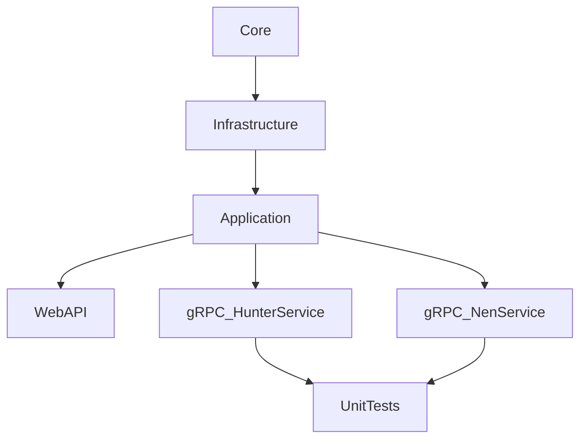

# Hunter x Hunter Microservices .NET 9

### Clean Code Architecture


### Packages (Server)
- Infrastructure
```
Microsoft.Extensions.Logging
Oracle.ManagedDataAccess.Core
ClassLibrary.Core
```
- Application
```
ClassLibrary.Infrastructure
```
- gRPC_HunterService
- gRPC_NenService
```
Grpc.AspNetCore
ClassLibrary.Application
```
- TestProject.UnitTests
```
Moq
ClassLibrary.Application
```

## gRPC: (google) Remote Procedure Call
- Diference between gRPC and API
> gRPC uses HTTP/2, while REST APIs typically use HTTP/1.1.

### gRPC
- Protocol Buffers
- http2
- Serealization, Deserealization
- Bidirectional streaming
- (Authentication, Load Balancer, Async Calls)

### API
- JSON
- REST

# Projects
- gRPC_HunterService
- gRPC_NenService

# Structure
```
/HxH_Microservice_.NETCore
│
├── /ClassLibrary.Application           <-- Librería de clases: Lógica de Aplicación
│   └── /Services
│       ├── HunterService.cs
│       └── NenService.cs
│
├── /ClassLibrary.Core                  <-- Librería de clases: Dominio (Core)
│   ├── /DTOs
│   │   ├── HunterDTO.cs
│   │   └── NenTypeDTO.cs
│   └── /Interfaces
│       ├── IHunterRepository.cs
│       ├── IHunterService.cs
│       ├── INenRepository.cs
│       └── INenService.cs
│
├── /ClassLibrary.Infrastructure        <-- Librería de clases: Infraestructura
│   ├── /Data
│   │   └── OracleDbContext.cs
│   └── /Repositories
│       ├── HunterRepository.cs
│       └── NenRepository.cs
│
├── /gRPC_HunterService                 <-- Microservicio de Hunter (gRPC)
│   ├── /Proto
│   │   └── hunter.proto
│   ├── /Services
│   │   └── HunterGrpcService.cs
│   └── Program.cs
│
├── /gRPC_NenService                    <-- Microservicio de Nen (gRPC)
│   ├── /Proto
│   │   └── nen.proto
│   ├── /Services
│   │   └── NenGrpcService.cs
│   └── Program.cs
│
├── /gRPC_Gateway                       <-- Proyecto WebAPI (si decides exponer una API RESTful)
│   ├── /Controllers
│   └── Program.cs
│
└── /TestProject.UnitTests              <-- Proyecto de pruebas unitarias
    ├── /Application.Tests
    │   ├── HunterServiceTests.cs
    │   └── NenServiceTests.cs
    ├── /Infrastructure.Tests
    │   ├── DatabaseCollection.cs
    │   ├── DatabaseFixture.cs
    │   ├── HunterRepositoryIntegrationTests.cs
    │   └── NenRepositoryIntegrationTests.cs
    └── /WebAPI.Tests
        └── HunterControllerTests.cs
```

# Steps for creation Clean Architecture


<hr>
<hr>
<hr>

1. Create a .proto file in Proto folder
2. New item -> search grpc or proto -> find Protocol Buffer File
```
syntax = "proto3";

option csharp_namespace = "gRPC_Service.Protos";

package my;

service MyService {
  rpc GetMy (MyRequest) returns (MyResponse);
}

message MyRequest {
  int32 id = 1;
}

message MyResponse {
  string name = 1;
  float isNice = 2;
}
```
3. Add the proto file to the project .csproj
```
<ItemGroup>
	<Protobuf Include="Protos\my.proto" GrpcServices="Server" />
</ItemGroup>
```
4. Create gRPC Service in Services folder
```
using Grpc.Core;
using gRPC_Service.Protos;

namespace gRPC_Service.Services;

public class MyGrpcService : MyService.MyServiceBase
{
    public override Task<NenResponse> GetMyData(MyRequest request, ServerCallContext context)
    {
        return Task.FromResult(new MyResponse
        { 
            Id = 1, 
            IsNice = true 
        });
    }
}
```
5. Add the service to the Program.cs
```
app.MapGrpcService<MyGrpcService>();
```

# Oracle DB Connection and OracleDbContext.cs
1. Add the Oracle.ManagedDataAccess package to the project
2. Configure appsettings.json
```
"ConnectionStrings": {
    "OracleDb": "User Id=testing;Password=testing;Data Source=localhost:1521/xe"
}
```
3. Create a new class for the database connection OracleDbContext.cs
- Use OracleDataAdapter to execute SELECT queries
- Use OracleCommand to execute INSERT, UPDATE, DELETE queries
- Use OracleParameter to pass parameters to the queries
- Use DataTable to store the results of the queries
```
public class OracleDbContext
{
    private readonly string _connectionString;
    private readonly ILogger<OracleDbContext> _logger;

    public OracleDbContext(string connectionString, ILogger<OracleDbContext> logger)
    {
        _connectionString = connectionString;
        _logger = logger;
    }

    public async Task<DataTable> ExecuteQueryAsync(string query, params OracleParameter[] parameters)
    {
        try
        {
            using var connection = new OracleConnection(_connectionString);
            await connection.OpenAsync();

            using var command = new OracleCommand(query, connection);
            if (parameters.Length > 0)
                command.Parameters.AddRange(parameters);

            using var reader = await command.ExecuteReaderAsync();
            var resultTable = new DataTable();
            resultTable.Load(reader);

            _logger.LogInformation("[OracleDbContext] Query executed: {Query} with Parameters: {@Parameters}", query, parameters);
            return resultTable;
        }
        catch (Exception ex)
        {
            _logger.LogError(ex, "[OracleDbContext] Error in ExecuteNonQueryAsync with query: {Query} and Parameters: {@Parameters}", query, parameters);
            throw;
        }        
    }

    public async Task<int> ExecuteNonQueryAsync(string query, params OracleParameter[] parameters)
    {
        try
        {
            using var connection = new OracleConnection(_connectionString);
            await connection.OpenAsync();

            using var command = new OracleCommand(query, connection);
            if (parameters.Length > 0)
                command.Parameters.AddRange(parameters);

            _logger.LogInformation("[OracleDbContext] Query execute correctly: {Query}", query);
            return await command.ExecuteNonQueryAsync();
        }
        catch (Exception ex)
        {
            _logger.LogError(ex, "[OracleDbContext] Error in ExecuteNonQueryAsync with query: {Query}", query);
            throw;
        }
    }
}
```